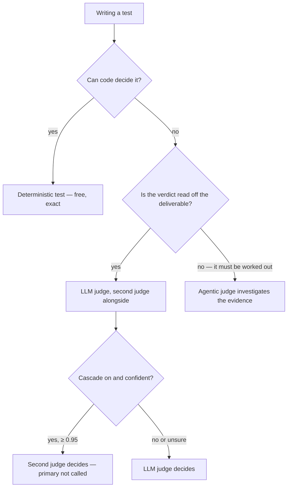

Every judged test spends money and can be wrong. The interesting question is never "which judge is best" — it is **what each judge costs, what its failures look like, and which failures it shares with the others**. This page is that picture. Every number on it was measured on apo's own runs, not borrowed from a model card.

## The price ladder

Four things can decide a test. They are not interchangeable, and the cheap ones are not merely worse versions of the expensive ones — they fail differently.

| Decider | Cost per test | Latency | Decides well | Fails by |
|---|---|---|---|---|
| Deterministic test (`t.check`) | $0 | milliseconds | exact facts — schema matches, tool calls, counts | says nothing about quality |
| Decision-model judge (the second judge) | ~$0.0001 | ~0.3 s | read-off verdicts, with a confidence number | coin-flip on anything that must be worked out |
| LLM judge (`t.judge`) | ~$0.003 | ~25 s | natural-language criteria | plausible-but-wrong passes, confidently |
| Agentic judge (`t.agent`) | ~$0.003 | ~25 s, multi-step | verdicts that must be derived from evidence | refusing to decide when it can't verify |

Two facts in that table surprise people. The decision model is **two orders of magnitude cheaper and fifty times faster** than the LLM judge — and the agentic judge, which investigates the deliverable with tools over multiple steps, costs about the same as one single-shot LLM call. Cheap-first is not about quality tiers; it is about knowing which failure mode each rung owns.

## Two judges, one error bar

One judge gives you a verdict. Two judges of different kinds give you an error bar. apo can grade every `t.judge` test twice: your LLM judge decides, and a **second judge** — a typed-decision model that cannot generate text — grades the same deliverable alongside it, reporting a probability and a confidence instead of prose. The marks, the env vars, and the projection option live on the [Tests page](/concepts/tests/#the-second-judge).

Measured on 2,094 judged tests from production, replayed through the second judge: **96.2% agreement** with the LLM judge, for a total spend of **$0.20**. The disagreements were not noise — they clustered on exactly the tests whose criteria were ambiguous or where the primary judge contradicted the rubric. That is the point of the pairing: disagreement is a signal about your *specification*, arriving at 1/100th of a cent per test.

## What confidence buys

The second judge's confidence is a difficulty meter, and it is worth reading literally:

| Second-judge confidence | Share of tests | Agreement with the LLM judge |
|---|---|---|
| ≥ 0.95 | 72% | **99.5%** |
| 0.6 – 0.95 | 20% | 94.5% |
| < 0.6 | 8% | 71.3% |

Three-quarters of tests land in the band where the two judges are nearly the same judge. That measurement is the entire basis for cascade mode.

## Cascade: let the confident verdict stand

Dual mode keeps a strict division: the LLM judge decides, the second judge corroborates. **Cascade mode** flips the order for cost — the second judge answers *first*, and when it returns a verdict at ≥ 0.95 confidence, that verdict stands and the LLM judge is never called:

```ts
t.judge(value, instruction, { judge: { mode: "cascade" } }) // one test
task("id", { judge: { mode: "cascade" }, /* … */ })          // one task
```

```bash
export APO_JUDGE_MODE=cascade # every t.judge test in the run
```

Everything else — low confidence, a transport error, an input too large for the decision model's context, a projected view — falls through to the LLM judge exactly as in dual mode. The mode can only fail open. A cascade-decided test says so in its report (`judge.verdict_by: "second-judge"`, the decision model in `judge.model`), so a wrong confident verdict is as visible as a wrong primary verdict — never a silent substitution.

The exchange, measured on the same fixed task run both ways:

```
# dual mode
apo task run judge-flip-probe
  Checks: 4 PASS · 6 FAIL
  Second judge: 10 corroborated

# cascade mode — same task, same memo, same verdicts
APO_JUDGE_MODE=cascade apo task run judge-flip-probe
    FAIL quantifies-synergies
      Verdict by second judge (cascade): fail · confidence 1 · p(pass) 0.
      Primary judge not called.
  Second judge: 9 corroborated · 1 unsure
```

| | dual mode | cascade mode |
|---|---|---|
| Verdicts | 10 | **10 — identical** |
| Decided by the second judge | 0 | 6 (confidence 0.98–1.0) |
| LLM judge calls | 10 | **4** |
| Second-judge spend | $0.00028 | $0.00028 |

Six of ten tests never reached the LLM judge; the four that did were exactly the ones below the gate — including both deliberately borderline criteria in that probe. Scale that over CI on every commit, monitors re-running suites, and stability replays, and judging spend drops by roughly what the confident band covers: **~70%, with ~0.5% of verdicts differing** from what the primary alone would have said.

:::tip
Keep dual mode while you are still engineering a suite's criteria — disagreement between two judges is the signal that a criterion is soft, and cascade spends that signal for money. Switch to cascade when the suite is stable and running at scale.
:::

## What cheap judges cannot do

The confidence gate has a hard boundary, and it is worth understanding because it is the same boundary the whole industry keeps rediscovering: **cheap judges fail on verdicts that must be derived, not read off.**

apo measured this directly on a 55-run panel where every run had a known-correct answer (a deterministic benchmark comparison — no LLM in the grading). All three judges graded every run, same model class, same criteria:

| Judge | Accuracy | Failure shape |
|---|---|---|
| LLM judge (single-shot, flash) | 61.8% | 20 false passes — confidently, and **unanimously across three samples** |
| Second judge (decision model) | 50.9% | passed **0 of 55** runs — coin-flip on derived answers, at high confidence |
| Agentic judge (investigates the evidence) | **100%** | 3 refusals, all fail-closed on wrong answers |

Three lessons fall out of that table, and each one kills a tempting shortcut:

- **Resampling doesn't fix bias.** 17 of the single-shot judge's 21 wrong verdicts were unanimous across three samples, and a majority-of-three scored *worse* than one call. Plausibility bias is systematic, not noise — you cannot sample your way out of it.
- **Confidence doesn't cross domains.** The same decision model that agrees 99.5% with the LLM judge on read-off criteria is at coin-flip on computed answers — while reporting high confidence. A gate only routes where the first stage is *competent but uncertain*.
- **Escalation is not accuracy.** Ask a second LLM to check a first one and you mostly get the same mistakes — a 2026 study of decision-model cascades found LLM fallbacks repeat 96% of the cheap judge's confident errors ([arXiv:2609.29769](https://arxiv.org/abs/2609.29769)); another found cascades keep a strong judge's accuracy at lower cost but add almost none of their own ([arXiv:2609.26550](https://arxiv.org/abs/2609.26550)). The agentic judge in the table above is the exception that proves the rule: it repeated **0 of 21** of the single-shot's errors, because it doesn't re-read the prompt — it goes and looks.

## Route by what the test asks

None of that is trivia; it is a routing rule. When you write a test, you already know which kind of verdict it demands:



| The criterion says… | Verdict type | Write it as |
|---|---|---|
| "the memo names the target" | read off | `t.judge` (+ second judge; cascade at scale) |
| "all dates use ISO 8601" | read off (or exact) | `t.judge`, or a deterministic matcher |
| "the computed fee is right" | derived | `t.agent`, or a deterministic comparison |
| "the code actually works" | derived | `t.agent` or a real test — never a single-shot judge |
| "calls no more than 20 tools" | exact | deterministic test |

Cheap-first where the verdict is read off; investigation where it must be worked out; code wherever code can decide. Cascade mode is the automation of the first clause — nothing more, and it never escalates past the LLM judge.

:::note
All prices are OpenRouter flash-class at the time of measurement, and the accuracy numbers come from apo's own production checks and gold-labeled panels. Your criteria mix will shift the bands — which is exactly why every cascade-decided test carries its provenance, and why corrections still override anything a judge said.
:::
