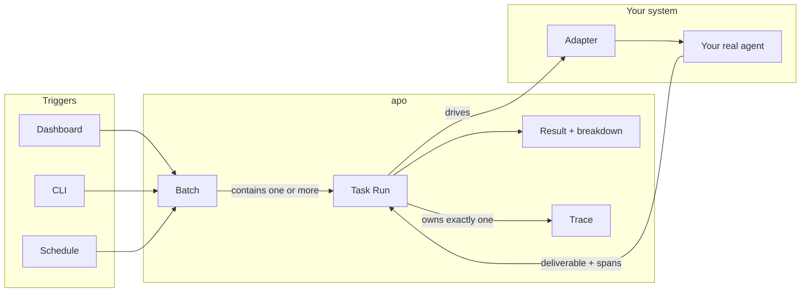

A task moves through a fixed pipeline: you write it, something triggers it, your agent runs it, and apo wraps the run in a result and a trace.

Three zones, left to right: triggers start things, apo holds the run and its results, your system is where the agent executes.

## You write a task

A **task** is a test file (`.eval.ts`). It declares what the agent should produce (the **deliverables**), how to feed it input, and what counts as "good" (the **tests**).

## Something triggers it

A **trigger** starts a task. There are three kinds:

- You click **Run** in the dashboard.
- You (or a coding agent) runs `apo task run` from the **CLI**.
- A **schedule** fires on its own (nightly, on every commit, whatever you set).

The trigger decides *when* the task runs. It doesn't change how it's judged.

## The run always lives in a batch

Every task run is wrapped in a **batch**: the container for task runs that happened together. Even a single `apo task run` creates a one-task batch. This is why the dashboard shows batches, never loose runs.

Inside the batch, each **task run** is one execution of one task. Run three tasks and the batch has three task runs, each with its own result.

## Your agent runs in your system, not in apo

apo doesn't execute your agent. **Your adapter does.**

The adapter is code you write (see [Adapters](/concepts/adapters/)): the bridge between apo and your real agent. apo hands it the task input, the adapter calls your actual LLM, your tools, your application code, and hands back what the agent produced. apo never touches your agent directly.

During a run:

- **In your system:** the adapter drives the agent, the agent calls tools and produces output, the deliverable comes back.
- **In apo:** the run records everything (every tool call, every message, every token) into a **trace**.

## You get a result and a trace

When the run finishes:

- A **result**: pass or fail. If any test failed, the run failed. Alongside it is a **breakdown** showing each test, what it expected, and what it got.
- A **trace** is the full runtime record of that one run: the call tree, the messages, the token counts. One run, one trace, never two, never zero.

If it failed, the breakdown tells you *which test* broke, and the trace tells you *why*: what the agent did that didn't meet the standard.

## Reference

| Term | What it means |
|---|---|
| **Task** | The test file. Declares deliverables, input handling, and tests. |
| **Trigger** | What started the run: dashboard, CLI, or schedule. |
| **Batch** | The container for one or more task runs. Always exists. |
| **Task run** | One execution of one task. Produces a result and a trace. |
| **Adapter** | Your code. Drives your real agent; apo calls it. |
| **Result** | Pass or fail, with a per-test breakdown. |
| **Trace** | The runtime record of one run. One per run, no exceptions. |

## Next

- [Tasks](/concepts/tasks/) cover the folder convention and the `.eval.ts` shape.
- [Adapters](/concepts/adapters/) are the bridge between apo and your real agent.
- [Tests](/concepts/tests/) define "good" for a run.
- [Traces](/concepts/traces/) are the debugging surface.
