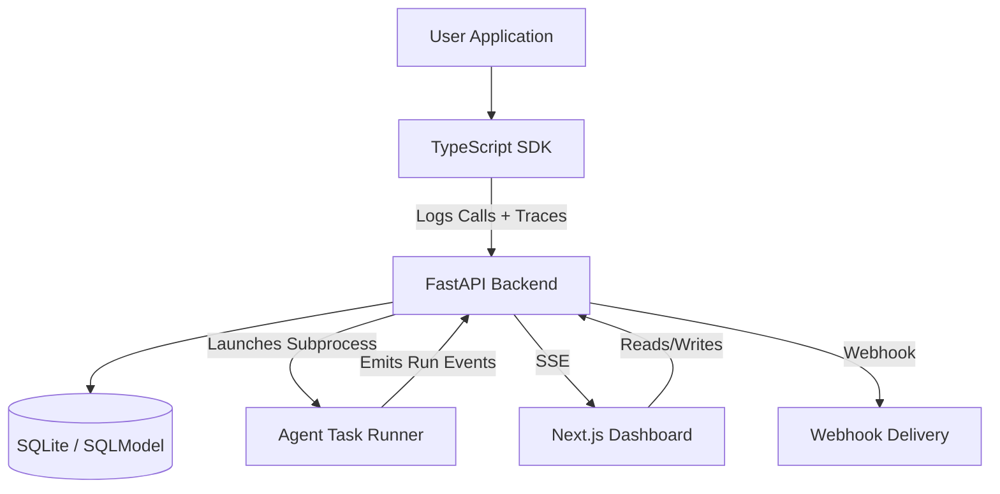
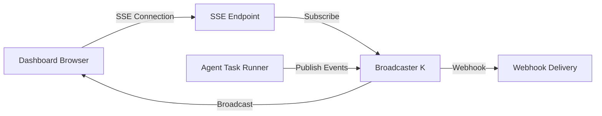

# Architecture

## System Components

The project is a monorepo structured as follows:

### 1. Backend (`/backend`)
- **Language**: Python (FastAPI)
- **Persistence**: SQLite via SQLModel
- **Responsibility**: Central hub for logging, parameter registration, eval management, and triggering optimization routines
- **Key Modules**:
  - `telemetry`: Handles the ingestion of `LoggedCall` data
  - `parameters`: Manages `ParameterDefinition` and `ParameterSetCandidate`
  - `eval_sets`: Manages test cases for optimization
  - `optimization`: Handles callback configurations and triggering external optimization logic

### 2. SDK (`/packages/sdk`)
- **Language**: TypeScript
- **Responsibility**: A lightweight wrapper around the OpenAI client. It automatically intercepts calls to log them to the backend and provides utilities for registering typed parameters.
- **Integration**: Designed to be a drop-in replacement for the standard client.

### 3. Dashboard (`/apps/dashboard`)
- **Tech Stack**: Next.js, Tailwind CSS
- **Responsibility**: Technical UI for developers to run agent tasks, inspect task/run history, debug traces, manage schedules, and use datasets/evals as supporting quality assets.

### 4. Example Service (`/apps/example-service`)
- **Responsibility**: A playground application used to test the SDK and demonstrate how to use the system in a real-world scenario.

## Authentication Bootstrap

Account creation is exposed through the dashboard's public `/setup` route.

- The first account created through `/auth/setup` becomes an admin.
- Later accounts created through the same flow become standard users.
- The sign-in page should always expose a path to account creation; role assignment happens in the backend based on whether any users already exist.

## Auth Boundaries

The system has three distinct authentication modes. They should not be mixed.

1. **Dashboard user session**
   - created by NextAuth in the dashboard
   - represented by the `authjs.session-token` cookie on the dashboard origin
   - used for page access and normal user-driven dashboard requests

2. **Dashboard-to-backend bridge**
   - browser-side protected requests go through the dashboard's same-origin proxy
   - server-rendered dashboard requests use `BACKEND_URL` directly; they never
     self-fetch the public dashboard origin, which may be unreachable behind a
     reverse proxy or published on a different host port
   - server-side dashboard fetches that target protected backend routes must use
     the same `backendFetch` bridge so the session cookie is forwarded; the
     bridge chooses the internal URL instead of the public proxy path
   - both paths forward the user session to the backend
   - FastAPI re-validates the same session before returning protected data

3. **Backend-owned service auth**
   - used by agent-task subprocesses and other backend-launched jobs
   - must use a short-lived bearer token or scoped API key
   - must never reuse a browser session cookie

### Agent-Task Trace Auth

Agent-task tracing now uses a backend-issued short-lived service token:

- the backend runner mints a token per task run
- the token is scoped to one `agent_task_run_id` and one project
- the token is passed into the subprocess as `APO_AUTH_TOKEN`
- the SDK trace client sends it as `Authorization: Bearer <token>`
- the backend only accepts that token on trace-ingestion and run-completion routes

This keeps the auth model clean:

- humans authenticate with sessions
- internal jobs authenticate with service tokens
- external integrations authenticate with persistent API keys

### OTel-Native Trace Ingestion

OpenTelemetry is the integration boundary for agent observability. Provider
instrumentation (OpenAI, Anthropic, Vercel AI SDK, LangChain, or custom spans)
exports standard OTLP; apo does not require provider-specific trace clients or
a custom wire format.

The write path has explicit ownership boundaries:

1. The host application owns instrumentation, context propagation, and its OTel
   `TracerProvider` unless it explicitly asks an apo bootstrap helper to do so.
2. Auth middleware derives the Project from an API key or short-lived service
   token. Telemetry attributes never select a tenant or authorize a Task Run.
3. The OTLP route resolves the Project's `trace_content_policy`. New, migrated,
   and legacy-without-row Projects fail closed to `redacted`; `full` is an
   explicit Project setting.
4. The receiver sanitizes the decoded OTLP graph once, including resource,
   scope, span, event, and link attributes. Both the durable inbox and canonical
   span store derive from that same sanitized graph.
5. A verified Task Run claim is reserved in the request transaction and only
   its verified ID is retained with the batch. Raw credentials are never queued.
6. The durable worker claims the exact batch, uses an expiring processing lease,
   and records `projected`, `partial`, or `failed` truthfully.
7. Projection materializes `RunDB` and `LoggedCallDB` for current product APIs.
   Public OTel IDs are preserved, while storage identity and every lookup are
   Project-scoped. Canonical OTLP spans remain the replayable source of truth
   when conventions or projection schemas change.

This separation is the intended extension point: add framework convention
normalizers over canonical spans, not provider-specific ingestion endpoints.

### Cost System (SPEC-136)

Cost is data, not code. apo prices calls against a normalized
`(model, tier, usage_key) → price` table and computes the per-dimension
breakdown once at ingestion, freezing it on the call. The dashboard and CLI
read stored breakdowns; there is no client-side pricing fetch or recompute.

**Three tables** (`backend/apo/models/pricing.py`):
- `models` — one row per (model era, project). Same `match_pattern` across
  eras; `[start_date, end_date)` selects the era (time-windowed pricing).
- `pricing_tiers` — a tier within a model. Exactly one default tier;
  non-default tiers match on usage-only threshold conditions
  (`{keys, operator, threshold}`, summing canonical keys).
- `prices` — micro-USD per 1M tokens (INTEGER) for one `(model, tier, usage_key)`.

**Six canonical usage keys** (`models/usage_keys.py`): `input`,
`cache_read`, `cache_write_5m`, `cache_write_1h`, `output`, `reasoning`.
Provider SDK aliases are mapped onto these by the normalizer.

**Single normalizer** (`services/usage_normalization/`): maps each provider's
raw usage attributes onto the canonical keys at ingestion, enforcing the OTel
GenAI non-overlap invariant (cache/reasoning subtracted from input/output so
families don't double-count). Per-provider resolvers: OpenAI, Anthropic,
Bedrock, Gemini, plus a generic fallback. Provider detection is a multi-signal
hierarchy (`providerMetadata` key-membership → `gen_ai.system` → model-name
prefix → generic).

**Single compute function** (`services/pricing/compute.py:compute_cost`): used
by ingestion, re-pricing, and the match endpoint. Resolves era → tier → prices,
then `breakdown[k] = round(price × tokens / 1e6)` per dimension (micro-USD int);
`total = sum(breakdown)`. Provided SDK cost wins verbatim (provenance
`provided`); otherwise computed (provenance `computed`).

**Per-call storage**: `LoggedCallDB` carries the frozen `cost` (micro-USD int),
`cost_breakdown` (JSON), `raw_usage` (JSON, the normalized map kept for
re-pricing), the matched `model_id`/`tier_id`/`tier_name`, and `cost_provenance`.

**Defaults ship as JSON** (`data/default-model-prices.json`): the sole source
of truth for `__global__` pricing, re-applied idempotently on every startup
(per-model `updated_at` exact-equality). Per-project overrides come via the API,
which rejects `__global__` writes (409).

**Re-pricing** (`services/reprice.py` + `apo reprice` CLI): an operator-only
history rewrite that recomputes `computed`-provenance calls against current
tiers from their stored `raw_usage`. Provided-cost and pre-migration calls are
skipped and reported. Triggered via an admin endpoint using a kick-off + poll
pattern (dodging the CLI's 15s HTTP timeout).

### Project Invitations (SPEC-127)

Project admins and owners invite teammates by email without requiring the
invitee to already have an account. The flow is fully project-scoped and
never consults `UserDB.is_admin`.

- **Pending invitation row** (`ProjectInvitationDB`) stores only a
  SHA-256 hash of the raw acceptance token. The raw token is returned
  exactly once to the inviter (for copy-link) or sent by email.
- **Email delivery is best-effort.** When SMTP is not configured (the
  default in self-hosted alpha), invitation creation still succeeds and
  the response carries a copyable `invite_url` with
  `delivery_status="link_only"`.
- **Acceptance has two paths:**
  - `POST /auth/invitations/accept/create-account` (public) creates the
    user + project membership in one step.
  - `POST /auth/invitations/accept/existing-account` (authenticated)
    attaches the invitation to the signed-in user, requiring an exact
    email match after normalization.
- **Public preview endpoint** (`GET /auth/invitations/preview`) reveals
  project/email/role metadata only for valid tokens; invalid, expired,
  revoked, and already-accepted tokens all return a generic reason.
- **Idempotency:** re-inviting the same email on the same project
  refreshes the existing active row in place (rotates token, extends
  expiry, updates role) instead of creating a duplicate. Revocation is
  a soft delete and is itself idempotent.
- **Demo workspace** rejects every invitation operation with `403`.

## Product Architecture: Agent Testing First

The product direction is now **agent testing and observability first**, not prompt optimization first.

That changes how the dashboard should be understood:

- **Primary surfaces**
  - `Tasks`
  - `Task Runs`
  - `Batch Runs`
  - `Schedules`
  - `Traces` (`/traces`) / canonical trace inspection
- **Supporting surfaces**
  - `Sessions`
  - `Settings` / user and system administration
- **Legacy surfaces**
  - `Optimization`
  - `Settings` while it remains only a legacy callback-support page

Current repo reality:

- `Sessions` exists as a real supporting route
- administration currently lives under `Settings`
- old dataset/evaluation affordances still exist as trace-level supporting actions, but not as first-class top-level dashboard routes
- IA and navigation work should follow the current route reality instead of preserving optimizer-era placeholders

### Core Mental Model

The main workflow is:

1. Define or discover an agent task
2. Run one task or many tasks
3. Inspect the resulting task runs
4. Drill into the shared trace view for debugging
5. Schedule future execution when the task should be re-validated automatically

Each task is one `*.eval.ts` module (e.g. `code-review.eval.ts`) that registers
its definition, optional `turn(...)` behavior, and all pass/fail checks. Code
assertions (`t.calledTool`, `t.check`, and related helpers) and LLM-backed
assertions (`t.judge`) share the same recorder, result shape, trace linkage,
and dashboard presentation. There is no separate criteria or checks module.

The dashboard presents every registered `test(...)` as a code check and shows
its block from the `.eval.ts` file. An LLM call is assertion-level implementation
detail: its model/prompt/response remain inspectable inside the assertion, but
it does not create a separate “LLM judge” result type or UI path.

This means the dashboard should optimize for:

- starting runs
- understanding failures
- inspecting traces
- reviewing history and freshness
- operating scheduled validation

It should **not** optimize its top-level information architecture around prompt-optimization workflows anymore.

### Execution Model

The agent-testing product uses a layered execution model:

- **Task**
  - one reusable validation scenario
- **Task Run**
  - one execution of one task
- **Batch Run**
  - one batch execution that triggered one or more task runs
- **Trace Run**
  - the shared observability layer used to inspect runtime behavior in detail
- **Schedule**
  - a recurring trigger that creates normal batch runs with `trigger.source = "schedule"`

Rules:

- `Task Run` is the primary object users inspect
- `Batch Run` provides execution context across related task runs
- each `Task Run` owns at most one `Trace Run`; all calls, tool activity, and
  checks from that execution belong inside that trace
- trace ingestion atomically claims the task run's trace ID and rejects a
  different second ID; retries using the claimed ID are idempotent
- `/traces` is the canonical trace inspection surface
- other product surfaces should reuse the shared trace components from `/traces`, not invent parallel trace UIs
- legacy optimization should not remain in the main shell navigation; keep it as a direct-route compatibility surface only until deletion is safe

### Canonical Trace Shell

The dashboard should have one canonical trace shell and multiple entry points into it.

- `/traces` owns the shared trace shell
- `TracesPageClient` provides the page frame and selection state
- `TracePanel` owns the right-side drawer behavior for inline trace inspection from the traces table
- `TraceWorkspace` owns the actual trace inspection UI: tree, timeline, graph, and detail pane
- standalone trace routes like `/traces/[runId]` and `/public/traces/[runId]` should render `TraceWorkspacePage`, not fork the trace UI
- task-run, session, and future agent-centric pages should link into or embed this same trace shell instead of shipping page-specific trace viewers

Current canonical render paths:

1. `/traces`
   - `apps/dashboard/src/app/traces/traces-page-client.tsx`
   - `apps/dashboard/src/components/trace-detail/TracePanel.tsx`
   - `apps/dashboard/src/components/trace-detail/TraceWorkspace.tsx`
2. `/traces/[runId]`
   - `apps/dashboard/src/app/traces/[runId]/page.tsx`
   - `apps/dashboard/src/components/trace-detail/TraceWorkspace.tsx`
3. `/public/traces/[runId]`
   - `apps/dashboard/src/app/public/traces/[runId]/page.tsx`
   - `apps/dashboard/src/components/trace-detail/TraceWorkspace.tsx`

Implications for future cleanup:

- the public `@/components/trace-detail` module should expose trace-first names only
- old `Run*` aliases may remain internally while migration is in progress, but new page code should not adopt them
- direct imports should prefer trace-first files such as `TraceDataContext`, `TraceDetailTabs`, `AddTraceToDatasetDialog`, and `TracesPageLayout`
- trace layout bugs should be fixed in the shared shell components first, because fixes there improve every trace entry point at once

### Shared Trace Entry Conventions

Every dashboard surface that links users into trace inspection should reuse the
same trace-entry primitives instead of inventing local buttons and labels.

- use shared trace entry components from `@/components/trace-detail`
- prefer `TraceHomeLink` for links from task runs, sessions, and future agent views
- keep the user-facing label anchored on **Trace home** when linking into the
  canonical `/traces` surface
- if a page needs inline trace rendering, embed the shared `TraceWorkspace`
  stack instead of building a page-specific trace detail viewer

### Vocabulary Rules

The backend and older APIs still use some optimizer-era field names such as `flow_name`.

User-facing dashboard language should follow these rules:

- prefer **Scope** when referring to `flow_name` in filters, table columns, and forms
- prefer **Task**, **Run**, **Trace**, and **Batch Run** over older flow-first wording
- mark optimization-specific routes and pages as **Legacy**

This allows the product surface to move to the new model without requiring an immediate deep backend rename.

### Legacy Archive And Removal

The recommended cleanup strategy is:

1. create a git archive checkpoint for the old product direction,
2. hide legacy prompt-optimization surfaces from primary navigation,
3. delete obsolete product-facing legacy code in stages,
4. remove backend/domain compatibility only after active UI migration is complete.

See [Legacy Archive And Removal Plan](./legacy-archive-removal-plan.md). (Plan doc pending; the optimizer-era code has already been removed from source.)

## Data Flow

### Logging
1. User App calls `sdk.chatCompletion`
2. SDK sends the request to OpenAI
3. SDK asynchronously sends the input, output, and metadata (runId, taskId, version, etc.) to Backend `/v1/log-call`
4. Backend persists the call to `logged_calls` table, including a `version` identifier
5. Aggregated metrics (call counts, average scores) can be retrieved via `/v1/analytics/versions` grouped by these identifiers

## Real-Time Updates with Server-Sent Events (SSE)

The backend pushes real-time updates to the dashboard over Server-Sent Events, eliminating polling. There are two live event streams, both built on the same generic in-memory broadcaster.

### Architecture Overview

### Components

#### Backend

1. **Generic core** (`services/broadcaster.py`)
   - `Broadcaster[K]` — in-memory pub/sub using `asyncio.Queue`
   - Manages multiple concurrent subscribers per key
   - Thread-safe via `asyncio.Lock`; non-blocking publish (drops on `QueueFull`)
   - Single-instance only (see Future Enhancements)

2. **Run events** (`services/run_events.py`, `routes/run_events.py`)
   - `RunEventBroadcaster` wraps `Broadcaster[str]`, keyed by project
   - Events: `task_run.started`, `task_run.completed`, `task_run.error`, `batch_run.completed`, `batch_run.failed`
   - `emit_task_run_event` / `emit_batch_run_event` publish from the daemon threads that execute runs (via `run_coroutine_threadsafe` on the captured event loop)
   - Also fans out to webhooks (`webhook_delivery.fire_webhooks_for_event`)

3. **Trace streaming** (`services/trace_broadcaster.py`, `routes/trace_stream.py`)
   - `TraceBroadcaster` wraps the same generic core, keyed by project
   - `TraceEvent.to_sse_format()` produces the SSE envelope; the route also builds an initial-events envelope inline

#### Frontend (`/apps/dashboard`)

- `hooks/use-run-events.ts` — `EventSource` lifecycle + reconnect + typed listeners for run lifecycle events
- `hooks/use-trace-stream.ts` — same pattern for live trace updates

### Data Flow

1. Browser opens an `EventSource` to the run-events or trace-stream endpoint
2. A run completes (or a trace event fires); the runner emits an event from its thread
3. The event is published to the singleton broadcaster for that project
4. The broadcaster pushes the formatted SSE message to every connected subscriber
5. The dashboard hook receives the event and updates UI state without a refresh

### Performance Characteristics

- **Latency**: sub-100ms from backend event to frontend update
- **Server Load**: one persistent connection vs. polling
- **Scalability**: in-memory broadcaster supports single-instance deployments (see Self-Hosted Alpha Topology)
- **Memory**: automatic cleanup of disconnected listeners

### Future Enhancements

For multi-instance deployments, replace the in-memory broadcaster with Redis pub/sub for cross-instance event distribution while keeping the same SSE frontend interface.

## Self-Hosted Alpha Topology (SPEC-124)

The supported self-hosted shape for internal alpha is **single-node**: one host runs one frontend container, one backend container (owning API + scheduler + task execution), and one database. Multi-replica backends are explicitly unsupported until a future release. See [`docs/self-hosted-alpha.md`](self-hosted-alpha.md) for the operator guide.

Operator-visible runtime state is exposed via:

- `GET /health/ready` — deep readiness probe (database, task-source cache, auth secret, task runtime). Returns 503 with a per-check breakdown when any prerequisite fails.
- `GET /v1/system/runtime-config` — admin-only descriptor of the running topology (backend URL, frontend URL, database URL, cache dir, scheduler state, supported topology).

Both are surfaced in the dashboard under **Settings → System → Deployment Topology**. The Compose healthchecks use `/health/ready` instead of the basic liveness probe so a deployed backend is only marked healthy when it can actually serve.

The public Server Profile adds Caddy as the only internet-facing service. Caddy
terminates HTTPS and forwards every request to the frontend; browser API calls
use the same-origin `/backend-proxy/*` bridge, while the canonical public OTLP
route `/api/public/otel/v1/traces` is rewritten by Next.js to the backend.
Frontend and backend diagnostic ports bind to `127.0.0.1`, and the database is
never published publicly. Caddy is a replaceable reference ingress: an existing
TLS proxy may forward the same public origin to the frontend without changing
the application contract.
