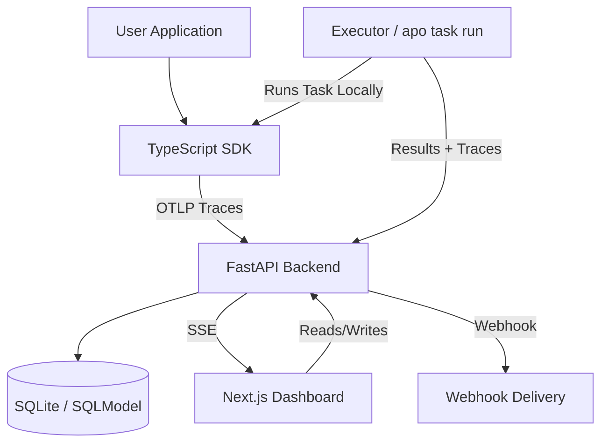
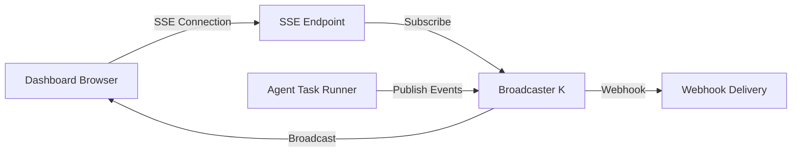

# Architecture

## System Components

The project is a monorepo structured as follows:

```mermaid
graph TD
    UserApp[User Application] --> SDK[TypeScript SDK]
    SDK --> |OTLP Traces| Backend[FastAPI Backend]
    Backend --> DB[(SQLite / SQLModel)]
    Dashboard[Next.js Dashboard] --> |Reads/Writes| Backend
    Executor[Executor / apo task run] --> |Runs Task Locally| SDK
    Executor --> |Results + Traces| Backend
    Backend --> |SSE| Dashboard
    Backend --> |Webhook| Webhooks[Webhook Delivery]
```

### 1. Backend (`/backend`)
- **Language**: Python (FastAPI)
- **Persistence**: SQLite via SQLModel
- **Responsibility**: Central hub for trace ingestion (OTLP), agent-task state, scheduling, execution queue/leases, pricing, and authorization. The Control Plane never executes Task code.
- **Key Modules**:
  - `otlp_traces` / `trace_*`: OTLP-native trace ingestion, projection, and streaming
  - `agent_task_*`: Task Runs, Batch Runs, Schedules, Revisions, Deliverables
  - `executor_*`: Executor Pools, enrollment, claim/lease protocol, Attempt JWTs
  - `pricing`: Model-era/tier/price tables and per-call cost computation

### 2. SDK (`/packages/sdk`)
- **Language**: TypeScript
- **Responsibility**: OpenTelemetry-native tracing (`@apo-ai/sdk/otel`) plus the agent-task authoring and runner API (`@apo-ai/sdk/agent-task`). Instrumentation exports standard OTLP; apo does not require a custom wire format.
- **Integration**: Framework integrations for OpenAI, Anthropic, Vercel AI SDK, and LangChain are registered through standard OTel providers.

### 3. Dashboard (`/apps/dashboard`)
- **Tech Stack**: Next.js, Tailwind CSS
- **Responsibility**: Technical UI for developers to run agent tasks, inspect task/run history, debug traces, manage schedules, and use datasets/evals as supporting quality assets.

### 4. Example Service (`/apps/example-service`)
- **Responsibility**: A playground application used to test the SDK and demonstrate how to use the system in a real-world scenario.

### Comparison evidence reads

A saved Task View comparison is an immutable snapshot of the exact resolved
Task Run IDs on both sides. The dashboard reads that snapshot and all resolved
run evidence through one project-scoped bulk endpoint. It must not fan those
IDs out into one HTTP request per run or refetch the same details when a row is
expanded; comparison size must not determine backend request concurrency.

SQLite deployments use short-lived connections rather than a bounded shared
queue. The backend currently performs synchronous SQLModel access from async
routes, so blocking on a full connection pool can otherwise stop the event
loop before completed requests get a chance to return their connections.

## Authentication Bootstrap

Account creation is exposed through the dashboard's public `/setup` route.

- The first account created through `/auth/setup` becomes an admin.
- Later accounts created through the same flow become standard users.
- The sign-in page should always expose a path to account creation; role assignment happens in the backend based on whether any users already exist.

## Auth Boundaries

The system has three distinct authentication modes. They should not be mixed.

1. **Dashboard user session**
   - created by NextAuth in the dashboard
   - represented by the `authjs.session-token` cookie on the dashboard origin
   - used for page access and normal user-driven dashboard requests

2. **Dashboard-to-backend bridge**
   - browser-side protected requests go through the dashboard's same-origin proxy
   - server-rendered dashboard requests use `BACKEND_URL` directly; they never
     self-fetch the public dashboard origin, which may be unreachable behind a
     reverse proxy or published on a different host port
   - server-side dashboard fetches that target protected backend routes must use
     the same `backendFetch` bridge so the session cookie is forwarded; the
     bridge chooses the internal URL instead of the public proxy path
   - both paths forward the user session to the backend
   - FastAPI re-validates the same session before returning protected data

3. **Executor protocol auth**
   - one-time enrollment tokens exchange for a long-lived Executor credential
   - the long-lived credential may heartbeat and claim authorized Pool work
   - every claimed Task receives a short-lived JWT scoped to its exact
     Attempt, Run, lease generation, and permissions
   - neither credential ever reuses a browser session cookie

4. **Anonymous demo reads** (the one deliberate public-surface exception)
   - a credential-less GET/HEAD is minted a synthetic `anonymous` credential
     by the auth middleware — only when the auth secret is properly
     configured and `APO_DEMO_ENABLED` is not `false` (the kill switch)
   - per-route authorization remains the boundary: anonymous reads resolve
     to a viewer-role membership on the `demo` project only; every other
     project fails closed exactly like any unauthenticated request
   - anonymous traffic is bounded by a per-IP sliding window
     (`DEMO_ANON_RATE_LIMIT_MAX`/`_WINDOW_SECONDS`) and every anonymous
     response carries `no-store`
   - the demo project's data comes from a shipped, gzip fixture reconciled
     at startup (digest-gated full reload); the project is permanently
     read-only

### Admission

Admission to an installation is **not** Project membership. A Hosted Access
Invitation is a single-use bearer capability issued by an Installation
Administrator; accepting it (publicly for a new account, or with a matching
authenticated session for an existing one) creates the invitee's User when
needed, exactly one new Project, one owner membership, and consumes the
invitation — all in one transaction that rolls back completely on any
failure. The issuer gains no membership, and the raw token is stored only as
a SHA-256 hash and shown exactly once (email, or the copy-link fallback when
`EMAIL_TRANSPORT_URL` is unconfigured). `require_installation_admin` accepts
browser-session authority only: Project API keys and executor capability
credentials cannot manage admission even when their creator is an
administrator.

### Agent-Task Trace Auth

Agent-task tracing uses an Attempt-scoped short-lived service token:

- the Control Plane mints a token only after an Executor claims a live lease
- the token is scoped to one Attempt, lease generation, Task Run, and Project
- the Executor passes it into the subprocess as `APO_AUTH_TOKEN`
- the SDK trace client sends it as `Authorization: Bearer <token>`
- every trace, Artifact, heartbeat, and finalization route checks the current
  database lease as well as the JWT

This keeps the auth model clean:

- humans authenticate with sessions
- Executors authenticate with long-lived hashed credentials
- Task children authenticate with expiring Attempt JWTs
- external integrations authenticate with persistent API keys

### OTel-Native Trace Ingestion

### Project Boundary

**Project** is apo's authorization boundary. Every Project-owned read, write,
stream, and deletion goes through one canonical credential-aware policy:

- **`authorize_project_request(request, session, project_id, minimum_role)`**
  — the single entry point. Intersects request Credential Authority with
  current Project membership and role. Returns the membership row or raises
  403/404/401.
- **`readable_project_ids_for_request(request, session)`** — the list-scoping
  companion. Session = all memberships; API key = exactly its bound Project
  (rechecked every request); unauthenticated in dev = `None` (legacy
  all-readable).

Credential kinds:

| Credential | Authority |
|---|---|
| Session (cookie) | All current memberships + roles |
| Project API key | Exact bound Project + creator membership recheck |
| Attempt/service token | Exact Project + Task Run capability (resource-specific authorizer) |
| Executor credential | Exact Project + Pool + Executor + permitted operation |

Invariants:

1. **Ownership is server-derived.** A body/query `project` narrows lookup but
   never proves authority.
2. **Lists fail closed.** Omitted `project` = readable set (or validation error),
   never every database row.
3. **Opaque IDs are identifiers, not secrets.** Cross-Project resource-ID routes
   return 404.
4. **Streams authorize before subscribing.** No initial data loads before authz.
5. **Release profiles reject synthetic ownership.** Development-only legacy
   fallback for nonexistent Projects; release = 404.
6. **Deletion covers bytes and rows.** Project delete removes all dependent rows
   + stored Task Revision bundles + Deliverable objects.

Route closure status: all registered Project-owned routes now call the canonical
policy or a resource-specific authorizer that calls it. The executor protocol
routes use capability-scoped checks (not human membership).

OpenTelemetry is the integration boundary for agent observability. Provider
instrumentation (OpenAI, Anthropic, Vercel AI SDK, LangChain, or custom spans)
exports standard OTLP; apo does not require provider-specific trace clients or
a custom wire format.

The write path has explicit ownership boundaries:

1. The host application owns instrumentation, context propagation, and its OTel
   `TracerProvider` unless it explicitly asks an apo bootstrap helper to do so.
2. Auth middleware derives the Project from an API key or short-lived service
   token. Telemetry attributes never select a tenant or authorize a Task Run.
3. The OTLP route binds the authenticated producer to one Project. Apo stores
   accepted Trace Content in full; instrumentation decides what is emitted and
   there is no Project-level redaction mode.
4. The receiver validates and persists the decoded OTLP graph once, including
   resource, scope, span, event, and link attributes. Both the durable inbox and
   canonical span store derive from that same full-fidelity graph. The typed
   span columns are the single home of span data — the inbox payload is a
   crash-window buffer that is blanked in the same transaction that marks a
   batch `projected`, and terminal audit rows are reaped on a window.
5. A verified Task Run claim is reserved in the request transaction and only
   its verified ID is retained with the batch. Raw credentials are never queued.
6. The durable worker claims the exact batch, uses an expiring processing lease,
   and records `projected`, `partial`, or `failed` truthfully.
7. Projection materializes `RunDB` and `LoggedCallDB` for current product APIs.
   Public OTel IDs are preserved, while storage identity and every lookup are
   Project-scoped. Canonical OTel spans remain the replayable source of truth
   when conventions or projection schemas change. Stage 2 single-homing makes
   that literal: `APO_PROJECTION_WRITE_MODE=slim` stops copying call I/O into
   `logged_calls` entirely — the projector writes through the same resolver
   (`projection_io.resolve_call_io`) the read paths hydrate from, so stored
   and resolved values cannot drift, and run-level list previews
   (`runs.input_preview/output_preview`) replace read-time truncation under
   `APO_LIST_READ=previews`. Span-less legacy rows serve their stored columns
   as a measured fallback until the fat columns can be dropped. A successful projection
   stamps the canonical span with the normalizer version in the same database
   transaction as its derived writes. Failed projections therefore remain
   visibly stale, while replay advances the stamp only after the replacement
   projection succeeds. Once a run is complete, every later span projection
   refreshes its stored aggregate metrics; this covers both children that
   arrive after the root and replay into an already-complete run.
   Duplicate span exports are resolved information-safely: a re-export that
   adds nothing never overwrites stored data (OTLP delivery is at-least-once).

This separation is the intended extension point: add framework convention
normalizers over canonical spans, not provider-specific ingestion endpoints.
Trace search rides the same store: `GET /v1/runs` accepts
service/operation/`span_text`/`span_filter` predicates compiled into
correlated `EXISTS` subqueries over `otlp_spans` — text ops in the text
domain, ordering ops in REAL — with `service_name` materialized at ingest
for the hottest filter. The list executes that (potentially heavy) filtered
statement once: `total_count` rides the page query as `COUNT(*) OVER()`
rather than a second full execution. Facets scan the same store through
covering indexes (`project_id, service_name, trace_id` and
`project_id, span_name, trace_id`) so per-trace distinct counts stay
index-only, with `(project_id, start_time)` letting the default 7-day
window prune.

### Cost System

Cost is data, not code. apo prices calls against a normalized
`(model, tier, usage_key) → price` table and computes the per-dimension
breakdown once at ingestion, freezing it on the call. The dashboard and CLI
read stored breakdowns; there is no client-side pricing fetch or recompute.

**Three tables** (`backend/apo/models/pricing.py`):
- `models` — one row per (model era, project). Same `match_pattern` across
  eras; `[start_date, end_date)` selects the era (time-windowed pricing).
- `pricing_tiers` — a tier within a model. Exactly one default tier;
  non-default tiers match on usage-only threshold conditions
  (`{keys, operator, threshold}`, summing canonical keys).
- `prices` — micro-USD per 1M tokens (INTEGER) for one `(model, tier, usage_key)`.

**Six canonical usage keys** (`models/usage_keys.py`): `input`,
`cache_read`, `cache_write_5m`, `cache_write_1h`, `output`, `reasoning`.
Provider SDK aliases are mapped onto these by the normalizer.

**Single normalizer** (`services/usage_normalization/`): maps each provider's
raw usage attributes onto the canonical keys at ingestion, enforcing the OTel
GenAI non-overlap invariant (cache/reasoning subtracted from input/output so
families don't double-count). Per-provider resolvers: OpenAI, Anthropic,
Bedrock, Gemini, plus a generic fallback. Provider detection is a multi-signal
hierarchy (`providerMetadata` key-membership → `gen_ai.system` → model-name
prefix → generic).

**Single compute function** (`services/pricing/compute.py:compute_cost`): used
by ingestion, re-pricing, and the match endpoint. Resolves era → tier → prices,
then `breakdown[k] = round(price × tokens / 1e6)` per dimension (micro-USD int);
`total = sum(breakdown)`. Provided SDK cost wins verbatim (provenance
`provided`); otherwise computed (provenance `computed`).

**Per-call storage**: `LoggedCallDB` carries the frozen `cost` (micro-USD int),
`cost_breakdown` (JSON), `raw_usage` (JSON, the normalized map kept for
re-pricing), the matched `model_id`/`tier_id`/`tier_name`, and `cost_provenance`.

**Defaults ship as JSON** (`data/default-model-prices.json`): the sole source
of truth for `__global__` pricing, re-applied idempotently on every startup
(per-model `updated_at` exact-equality). Per-project overrides come via the API,
which rejects `__global__` writes (409).

**Re-pricing** (`services/reprice.py` + `apo reprice` CLI): an operator-only
history rewrite that recomputes `computed`-provenance calls against current
tiers from their stored `raw_usage`. Provided-cost and pre-migration calls are
skipped and reported. Triggered via an admin endpoint using a kick-off + poll
pattern (dodging the CLI's 15s HTTP timeout).

### Generation Errors and Verdict Validity

Canonical OTLP span status and finish-reason attributes are execution evidence,
not ordinary check failures. At Task Run finalization, the trace backend joins
normalized `GENERATION` calls to their canonical spans and records a bounded
Generation Execution Summary (`total`, `errored`, and error finish-reason
counts) on the Task Run.

- OTel `ERROR` status or an error finish reason marks a Generation Observation
  errored.
- Errored Generation Observations do not contribute cost or tokens. Those
  totals are presented as partial, never as complete zero-valued measurements.
- If errored generations are a strict majority, execution—not expected
  behavior—dominated the result. The Task Run becomes `status: error` with
  `pass_result: null`; its Check Report remains available as diagnostic
  evidence but is not a PASS/FAIL score.
- A minority of generation errors represents a recovered execution. The
  ordinary verdict remains valid, while usage totals still disclose that they
  are partial.
- Legacy traces with no canonical Generation Observations keep the summary
  null. APO does not rewrite unknown historical evidence as zero errors.

### Task Run Deliverables and Artifacts

Deliverable **identity and metadata** are relational; large bodies live
outside the wide `agent_task_runs` row. The boundary exists because a
multi-megabyte `deliverables_json` column once OOM-killed the backend from a
task-list query, and `confirm_and_link` duplicated the full body into
`RunDB.output`.

- **`agent_task_deliverables` table**: one row per named Deliverable,
  Project-scoped, with a metadata-only manifest projection. Small JSON
  (≤64 KiB) is wrapped inline as `{"value": ...}`; large JSON is
  gzip-compressed once and written through an `ArtifactStore`; file bytes are
  immutable Artifacts with server-generated opaque storage keys, SHA-256, and
  declared media type. The single rule: **no list/detail/compare query loads a
  body unless the caller explicitly asks for one** — enforced by the
  metadata-only SQL projection.
- **`ArtifactStore`** (`services/artifact_stores/`): a `Protocol` with a
  zero-configuration `LocalArtifactStore` (atomic staged writes under the
  existing `/app/data` volume) and an optional `S3ArtifactStore` (R2 / MinIO /
  Backblaze via the AWS credential chain). The database owns identity and
  authorization; the store never becomes a listing source. Rows persist
  `storage_backend` so changing the write backend never reinterprets existing
  rows.
- **Two-phase uploads**: executors create an idempotent intent, then PUT raw
  bytes through authenticated Apo endpoints (no browser/executor receives
  bucket credentials). The backend independently counts and hashes; size or
  digest mismatch never becomes ready.
- **Canonical conversation is the Trace**: new recorders leave
  `transcript_json` null (the OTel Trace is the source of truth); legacy rows
  stay readable during the compat window via synthesized manifests.
- **Retention** removes external objects *before* database rows and fails
  closed on store errors so objects are never orphaned; expired pending
  uploads are failed and their staging bytes cleaned.

### Project Invitations

Project admins and owners invite teammates by email without requiring the
invitee to already have an account. The flow is fully project-scoped and
never consults `UserDB.is_admin`.

- **Pending invitation row** (`ProjectInvitationDB`) stores only a
  SHA-256 hash of the raw acceptance token. The raw token is returned
  exactly once to the inviter (for copy-link) or sent by email.
- **Email delivery is best-effort.** When SMTP is not configured (the
  default in self-hosted alpha), invitation creation still succeeds and
  the response carries a copyable `invite_url` with
  `delivery_status="link_only"`.
- **Acceptance has two paths:**
  - `POST /auth/invitations/accept/create-account` (public) creates the
    user + project membership in one step.
  - `POST /auth/invitations/accept/existing-account` (authenticated)
    attaches the invitation to the signed-in user, requiring an exact
    email match after normalization.
- **Public preview endpoint** (`GET /auth/invitations/preview`) reveals
  project/email/role metadata only for valid tokens; invalid, expired,
  revoked, and already-accepted tokens all return a generic reason.
- **Idempotency:** re-inviting the same email on the same project
  refreshes the existing active row in place (rotates token, extends
  expiry, updates role) instead of creating a duplicate. Revocation is
  a soft delete and is itself idempotent.
- **Demo workspace** rejects every invitation operation with `403`. Its data
  ships as a fixture (`apo/data/demo-workspace-v1.json.gz`) reconciled to the
  database at startup; it is world-readable at the viewer role — including
  anonymously — and `APO_DEMO_ENABLED=false` removes it from an install
  entirely.

## Product Architecture: Agent Testing First

The product direction is now **agent testing and observability first**, not prompt optimization first.

That changes how the dashboard should be understood:

- **Primary surfaces**
  - `Tasks`
  - `Task Runs`
  - `Batch Runs`
  - `Schedules`
  - `Traces` (`/traces`) / canonical trace inspection
- **Supporting surfaces**
  - `Sessions`
  - `Settings` / user and system administration
- **Legacy surfaces**
  - `Optimization`
  - `Settings` while it remains only a legacy callback-support page

Current repo reality:

- `Sessions` exists as a real supporting route
- administration currently lives under `Settings`
- old dataset/evaluation affordances still exist as trace-level supporting actions, but not as first-class top-level dashboard routes
- IA and navigation work should follow the current route reality instead of preserving optimizer-era placeholders

### Core Mental Model

The main workflow is:

1. Define or discover an agent task
2. Run one task or many tasks
3. Inspect the resulting task runs
4. Drill into the shared trace view for debugging
5. Schedule future execution when the task should be re-validated automatically

Each task is one `*.eval.ts` module (e.g. `code-review.eval.ts`) that registers
its definition, optional `turn(...)` behavior, and all pass/fail checks. Code
assertions (`t.calledTool`, `t.check`, and related helpers) and LLM-backed
assertions (`t.judge`) share the same recorder, result shape, trace linkage,
and dashboard presentation. There is no separate criteria or checks module.

The dashboard presents every registered `test(...)` as a code check and shows
its block from the `.eval.ts` file. An LLM call is assertion-level implementation
detail: its model/prompt/response remain inspectable inside the assertion, but
it does not create a separate “LLM judge” result type or UI path.

This means the dashboard should optimize for:

- starting runs
- understanding failures
- inspecting traces
- reviewing history and freshness
- operating scheduled validation

It should **not** optimize its top-level information architecture around prompt-optimization workflows anymore.

### Execution Model

The agent-testing product uses a layered execution model:

- **Task**
  - one reusable validation scenario
- **Task Run**
  - one execution of one task
- **Batch Run**
  - one batch execution that triggered one or more task runs
- **Trace Run**
  - the shared observability layer used to inspect runtime behavior in detail
- **Schedule**
  - a recurring trigger that creates normal batch runs with `trigger.source = "schedule"`
- **Task Revision**
  - immutable source identity; pooled Runs reference a bounded deterministic Bundle
- **Execution Attempt**
  - operational queue/lease state for one Task Run
- **Executor Pool**
  - an exact placement target owned by one Project
- **Judgment**
  - one recorded evaluation of a completed Task Run's tests; the run's own
    verdict is the synthesized `original` judgment, `apo runs rejudge`
    records `rejudge` judgments replayed against the run's stored
    Deliverables under a caller-chosen judge config

Rules:

- `Task Run` is the primary object users inspect
- `Batch Run` provides execution context across related task runs
- dashboard Batches and schedules always resolve one exact Pool before
  materializing a Revision and queued Attempts
- Pool placement never changes after creation; offline work waits until its TTL
- the Control Plane owns durable state and never executes customer Task code
- re-judging (issue #159) respects that boundary: the backend serves the
  pinned definition revision + Deliverables and stores judgments, but the
  replay executes in the CLI, where task code already executes
- judgments are append-only records beside a run: the run's original verdict
  columns and check report are never rewritten, and a judgment always
  replays the full test set (no per-test re-judging — that would ratchet an
  unstable verdict toward PASS)
- persistent Executors pull outbound and run one Batch sequentially while
  different Batches may use available capacity
- each `Task Run` owns at most one `Trace Run`; all calls, tool activity, and
  checks from that execution belong inside that trace
- trace ingestion atomically claims the task run's trace ID and rejects a
  different second ID; retries using the claimed ID are idempotent
- the project traces page is the canonical trace inspection surface
- other product surfaces should reuse the shared trace components from the traces page, not invent parallel trace UIs
- legacy optimization should not remain in the main shell navigation; keep it as a direct-route compatibility surface only until deletion is safe

### Canonical Trace Shell

The dashboard should have one canonical trace shell and multiple entry points into it.

- the project traces page owns the shared trace shell
- `TracesPageClient` provides the page frame and selection state
- `TracePanel` owns the right-side drawer behavior for inline trace inspection from the traces table
- `TraceWorkspace` owns the actual trace inspection UI: tree, timeline, graph, and detail pane
- the standalone trace route renders `TraceWorkspacePage`, not a fork of the trace UI
- task-run, session, and future agent-centric pages should link into or embed this same trace shell instead of shipping page-specific trace viewers

Current canonical render paths:

1. `/project/[projectId]/traces`
   - `apps/dashboard/src/app/project/[projectId]/traces/traces-page-client.tsx`
   - `apps/dashboard/src/components/trace-detail/TracePanel.tsx`
   - `apps/dashboard/src/components/trace-detail/TraceWorkspace.tsx`
2. `/project/[projectId]/traces/[runId]`
   - `apps/dashboard/src/app/project/[projectId]/traces/[runId]/page.tsx`
   - `apps/dashboard/src/components/trace-detail/TraceWorkspace.tsx`

Implications for future cleanup:

- the public `@/components/trace-detail` module should expose trace-first names only
- old `Run*` aliases may remain internally while migration is in progress, but new page code should not adopt them
- direct imports should prefer trace-first files such as `TraceDataContext`, `TraceDetailTabs`, `AddTraceToDatasetDialog`, and `TracesPageLayout`
- trace layout bugs should be fixed in the shared shell components first, because fixes there improve every trace entry point at once

### Shared Trace Entry Conventions

Every dashboard surface that links users into trace inspection should reuse the
same trace-entry primitives instead of inventing local buttons and labels.

- use shared trace entry components from `@/components/trace-detail`
- prefer `TraceHomeLink` for links from task runs, sessions, and future agent views
- keep the user-facing label anchored on **Trace home** when linking into the
  canonical `/traces` surface
- if a page needs inline trace rendering, embed the shared `TraceWorkspace`
  stack instead of building a page-specific trace detail viewer

### Vocabulary Rules

The backend and older APIs still use some optimizer-era field names such as `flow_name`.

User-facing dashboard language should follow these rules:

- prefer **Scope** when referring to `flow_name` in filters, table columns, and forms
- prefer **Task**, **Run**, **Trace**, and **Batch Run** over older flow-first wording
- mark optimization-specific routes and pages as **Legacy**

This allows the product surface to move to the new model without requiring an immediate deep backend rename.

### Legacy Archive And Removal

The recommended cleanup strategy is:

1. create a git archive checkpoint for the old product direction,
2. hide legacy prompt-optimization surfaces from primary navigation,
3. delete obsolete product-facing legacy code in stages,
4. remove backend/domain compatibility only after active UI migration is complete.

The optimizer-era code has already been removed from source; the historical cleanup intent is documented above.

## Data Flow

### Tracing (OTLP)
1. User App is instrumented with OpenTelemetry (OpenAI, Anthropic, Vercel AI SDK, LangChain, or custom spans)
2. SDK's OTel exporter sends OTLP to the backend's public route `/api/public/otel/v1/traces`
3. Auth middleware derives the Project from the API key or short-lived service token
4. The receiver validates and persists the decoded OTLP graph once (resource, scope, span, event, link attributes)
5. Projection materializes `RunDB` and `LoggedCallDB` rows for current product APIs, stamping the canonical span with the normalizer version
6. Cost is computed once at ingestion against the pricing tables and frozen on the call

Canonical OTLP spans remain the replayable source of truth when conventions or projection schemas change.

## Real-Time Updates with Server-Sent Events (SSE)

The backend pushes real-time updates to the dashboard over Server-Sent Events, eliminating polling. There are two live event streams, both built on the same generic in-memory broadcaster.

### Architecture Overview

```mermaid
graph LR
    Dashboard[Dashboard Browser] -->|SSE Connection| SSE[SSE Endpoint]
    SSE -->|Subscribe| Broadcaster[Broadcaster K]
    Runner[Agent Task Runner] -->|Publish Events| Broadcaster
    Broadcaster -->|Webhook| Webhooks[Webhook Delivery]
    Broadcaster -->|Broadcast| Dashboard
```

### Components

#### Backend

1. **Generic core** (`services/broadcaster.py`)
   - `Broadcaster[K]` — in-memory pub/sub using `asyncio.Queue`
   - Manages multiple concurrent subscribers per key
   - Thread-safe via `asyncio.Lock`; non-blocking publish (drops on `QueueFull`)
   - Single-instance only (see Future Enhancements)

2. **Run events** (`services/run_events.py`, `routes/run_events.py`)
   - `RunEventBroadcaster` wraps `Broadcaster[str]`, keyed by project
   - Events: `task_run.started`, `task_run.completed`, `task_run.error`, `batch_run.completed`, `batch_run.failed`
   - `emit_task_run_event` / `emit_batch_run_event` publish from the daemon threads that execute runs (via `run_coroutine_threadsafe` on the captured event loop)
   - Also fans out to webhooks (`webhook_delivery.fire_webhooks_for_event`)

3. **Trace streaming** (`services/trace_broadcaster.py`, `routes/trace_stream.py`)
   - `TraceBroadcaster` wraps the same generic core, keyed by project
   - `TraceEvent.to_sse_format()` produces the SSE envelope; the route also builds an initial-events envelope inline

#### Frontend (`/apps/dashboard`)

- `hooks/use-run-events.ts` — `EventSource` lifecycle + reconnect + typed listeners for run lifecycle events
- `hooks/use-trace-stream.ts` — same pattern for live trace updates

### Data Flow

1. Browser opens an `EventSource` to the run-events or trace-stream endpoint
2. A run completes (or a trace event fires); the runner emits an event from its thread
3. The event is published to the singleton broadcaster for that project
4. The broadcaster pushes the formatted SSE message to every connected subscriber
5. The dashboard hook receives the event and updates UI state without a refresh

### Performance Characteristics

- **Latency**: sub-100ms from backend event to frontend update
- **Server Load**: one persistent connection vs. polling
- **Scalability**: in-memory broadcaster supports single-instance deployments (see Self-Hosted Alpha Topology)
- **Memory**: automatic cleanup of disconnected listeners

### Future Enhancements

For multi-instance deployments, replace the in-memory broadcaster with Redis pub/sub for cross-instance event distribution while keeping the same SSE frontend interface.

## Self-Hosted Alpha Topology

The supported self-hosted shape for internal alpha is **single-node**: one host
runs a frontend and one backend Control Plane, backed by a database. Task
execution is Source-Owned: Tasks run on the user's machine via `apo task run`
or `apo connect`, so the server never executes Task code. The backend owns API
+ scheduler + durable execution state. Multi-replica backends remain
unsupported. See [`docs/self-hosted-alpha.md`](self-hosted-alpha.md) for the
operator guide.

Operator-visible runtime state is exposed via:

- `GET /health/ready` — Control Plane readiness (database, ArtifactStore, auth
  secret). Task execution is Source-Owned and happens on the user's machine,
  so it is not part of server-side readiness.
- `GET /v1/system/runtime-config` — admin-only descriptor of the running topology (backend URL, frontend URL, database URL, scheduler state, supported topology).

Both are surfaced in the dashboard under **Settings → System → Deployment Topology**. The Compose healthchecks use `/health/ready` instead of the basic liveness probe so a deployed backend is only marked healthy when it can actually serve.

The public Server Profile adds Caddy as the only internet-facing service. Caddy
terminates HTTPS and forwards every request to the frontend; browser API calls
use the same-origin `/backend-proxy/*` bridge, the canonical public OTLP route
`/api/public/otel/v1/traces` and the CLI's `/v1/*` + `/auth/*` routes are
rewritten by Next.js to the backend. The ingress owns transport, not identity
: admission shells render Apo's own login/join UI, and every
protected route is guarded by Apo's session/API-key authentication and Project
authorization — there is no installation-wide ingress password.
Frontend and backend diagnostic ports bind to `127.0.0.1`, and the database is
never published publicly. Caddy is a replaceable reference ingress: an existing
TLS proxy may forward the same public origin to the frontend without changing
the application contract. Because direct-VPS and tunnel modes share one
Caddyfile, both profiles supply a reserved `.invalid` docs hostname when the
optional public-docs overlay is absent; an empty hostname would make Caddy
interpret the docs block as a second global-options block and fail startup.

### Public Documentation Boundary

The project's public documentation (`docs.test-apo.online`) is served from the
same VPS as the application, but as a **separate, static, secret-free service** —
not an application feature and not part of every self-host installation. It is
an optional overlay (`docker-compose.public-docs.yml`) selected only by the
project operator's tunnel deployment.

- **Physical co-location, logical separation**: the docs container shares the
  host and the Cloudflare Tunnel, but has no repository mount, no `.env`, no
  Apo credential, no database access, no host port, and a read-only filesystem
  with all capabilities dropped. It contains only the built Astro output.
- **Host-terminal routing**: Caddy routes every request whose `Host` is the docs
  hostname to the docs container and stops. Docs-host requests can never reach
  the backend, OTLP, or readiness paths. The application hostname delegates
  identity entirely to Apo's application authentication — the
  ingress carries no Basic Auth gate of its own.
- **Agent-readable first-class**: `/start.md` and every `*.md` route are
  published and tested, not incidental Astro output. The landing-page Copy
  Prompt always names the canonical live origin.
- **Publication gate**: the docs build fails CI on drift — a stale `apo.dev`
  reference, a broken same-origin link, a missing schema artifact, or a
  Copy Prompt/origin disagreement.

